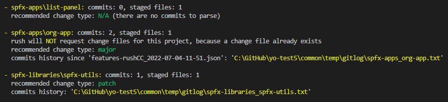

# generator-rush-conventionalcommits

[](https://rushjs.io/)
[](https://yeoman.io/generators/)

Adds **support** for change file generation based on [conventional commits](https://conventionalcommits.org/) convention to rush monorepos.



The difference between commit messages and rush's change files is explained by [Pete Gonzalez](https://github.com/octogonz):
>**Git commits document steps of work.** For example, when I create a PR, I might break it into 5 separate commits that are easier to review one by one, rather than reading the entire PR diff. And then during the code review, people may suggest various improvements, which may lead to 10 more commits before I finally merge my PR. Some of these commits will be pure bookkeeping (`ran "rush update"`, `merged from master`, etc). Git commits are written for the audience of people who work on the code. Whereas...<br/>
**Change logs inform consumers what's new.** Consumers need to know which bugs got fixed, which new features were added, or alert consumers about possible breaking changes. This audience often doesn't know anything about the underlying implementation, so a different style of writing is needed. In a monorepo, one Git commit might impact many different projects, and perhaps in a way that needs to be explained differently for each project. For certain important projects, the change log may serve as a public announcement to customers. The release team may have a step where they manually revise the changelog before publishing a release.

If you follow [Conventional Commits](https://www.conventionalcommits.org/en/v1.0.0/), your commits already contain information necessary for calculating the change type.
`rush change` detects changed projects based on your staged files and commits.
> At the time of this writing, any changed (staging, commits)  done after a change file is created, you will  NOT be asked to create another change file.

`rush whatchanged` always displays number of commits and staged files for each project.

- when used with `--recommend-changetype` it suggests a change type for each changed project, based on your commits since the 'mergeBase' detected by rush.
- when used with `--show-commits` it displays (`--show-commitsshortlog`) or saves to a file (`--show-commits full`) history of your commits made since the 'mergeBase'.

>**Important**: This solution is using [ProjectChangeAnalyzer](https://api.rushstack.io/pages/rush-lib.projectchangeanalyzer/) class which is still in BETA and may change. It is NOT recommended to use this API in a production environment.

## Commands

### rush whatchanged

```
usage: rush whatchanged [-h] [-b BRANCH] [--recommend-changetype] [--show-commits]

Provides support for creating change files.
Optional arguments:

-h, --help              Show this help message and exit.
-b BRANCH, --target-branch BRANCH
                        If this parameter is specified, compare the checked
                        out branch with the specified branch to determine
                        which projects were changed. If this parameter is not
                        specified, the checked out branch is compared against
                        the "main" branch.
--recommend-changetype
                        Parses commit messages included in the same revision
                        range as the one used by rush change. Based on the
                        commit type, suggest change type: 'major', 'minor',
                        'patch' or 'none'
--show-commits          Display commits included in the revision range used
                        by rush change.
```

### rush commitlint

```
usage: rush commitlint [-h] [--edit]

Used by the commit-msg Git hook.
This command invokes commitlint to ensure that the commit messages meet the conventional commit format.
The rules are defined in `commitlint.config.js` file; see https://commitlint.js.org/#/reference-rules for possible options.

-h, --help              Show this help message and exit.
--edit                  The commit message provided by a user

```

## Prerequisites

This generator requires that your project is managed with [rush](https://rushjs.io/pages/maintainer/setup_new_repo).
Run the following commands to initialize it:

- `rush init`
- `rush update`

## Installation

First, install [Yeoman](http://yeoman.io) and **generator-rush-conventionalcommits** using [npm](https://www.npmjs.com/).

```bash
npm install -g yo
npm install -g generator-rush-conventionalcommits
```

If not already done, configure git and rush:

```bash
git init
rush init
rush update
```

and follow [Adding projects to a repo](https://rushjs.io/pages/maintainer/add_to_repo/) to configure which projects are managed by rush.

Then add the conventional commits support:

```bash
yo rush-conventionalcommits
```

## rush-conventionalcommits configuration

This generator creates the following resources:

### autoinstallers

- **rush-commitlint**: rush autoinstaller installing:
  - `@commitlint/cli` and
  - `@commitlint/config-conventional`

- **rush-changemanager**: rush autoinstaller installing:
  - `@microsoft/rush-lib`,
  - `@rushstack/node-core-library`,
  - `yargs` and
  - `conventional-commit-types`

### custom commands

- **`rush commitlint`** runs `commitlint` on the commit messages; used by the commit-msg Git hook.
- **`rush whatchanged`** 'explains' why change file is required, by printing number of commits and staged files for each project. It also provides recommendation for a change type, and prints commits history (console or a file in a rush temp folder)

### git-hooks

- **commit-msg** invokes `rush commitlint` to ensure the commit message has correct format
- **pre-push** (optional) invokes `rush change -v` to verify change files are generated for changed projects

> **Important**: Rush will install git hooks during `rush update` executed as part of this generator. For this step to succeed, you must **initialize the git repo** first. Otherwise, please execute the `rush update` command manually, once you are ready.

### scripts

#### **scripts/rush-whatchanged.js**

- **Display commits history:** For each project returned by `projectAnalyzer.getChangedProjectsAsync`, display commits history since merge base, by executing

```sh
git shortlog ${mergeHash}... ${since} -- "${project.projectRelativeFolder}"
```

or

```sh
git --no-pager log ${mergeBaseHash}... ${since} -- "${projectRelativeFolder}" > ${targetPath}
```

- **Suggest change type** For each project returned by `projectAnalyzer.getChangedProjectsAsync`, obtain commits indicating major/minor/patch change, using

```sh
git rev-list --count --extended-regexp --grep ${regex} -- ${projectFolder}
```

The conventional commit types are retrieved from [conventional-commit-types](https://www.npmjs.com/package/conventional-commit-types).

To limit parsed commits, the merge base is retrieved using

```sh
git --no-optional-locks merge-base -- HEAD ${branchName}
```

This is the same command as used by `ProjectChangeAnalyzer` in `this._git.getMergeBase` invocation.

## Testing

- make a change in any of the projects managed by rush (listed in rush.json)
- `git add .`
- `git commit -m "fix: testing rush change file generation"`
- `rush whatchanged --recommend-changetype`
- observe the information printed to the terminal. The first time a rush command depending on an autoinstaller is executed, rush will install Rush engine, package manager, dependencies defined in the autoinstaller. The next time, the command will execute much faster.
- see the recommendation for the change type

## Older version of rush?

This generator requires **rush 5.66.2**.
If you are using older version, and are not yet ready to upgrade, you may "downgrade" this solution.

### rush v5.64.0

Update the **common\autoinstallers\rush-changemanager\package.json** file. Change:

```json
    "@microsoft/rush-lib": "^5.66.2",
    "@rushstack/node-core-library": "^3.45.2",
```

to:

```json
    "@microsoft/rush-lib": "^5.64.0",
    "@rushstack/node-core-library": "^3.45.0",
```

### rush v5.63.1 or older

Rush **5.64.0** introduces `--quiet` command for suppressing startup information.
Apart from updating **common\autoinstallers\rush-changemanager\package.json** to reference correct version of rush modules, update the `git hooks` to remove the `--quiet` flag.

See the [Rush and Conventional Commits Series](https://dev.to/kkazala/series/17133) for detailed description.
npm publish
